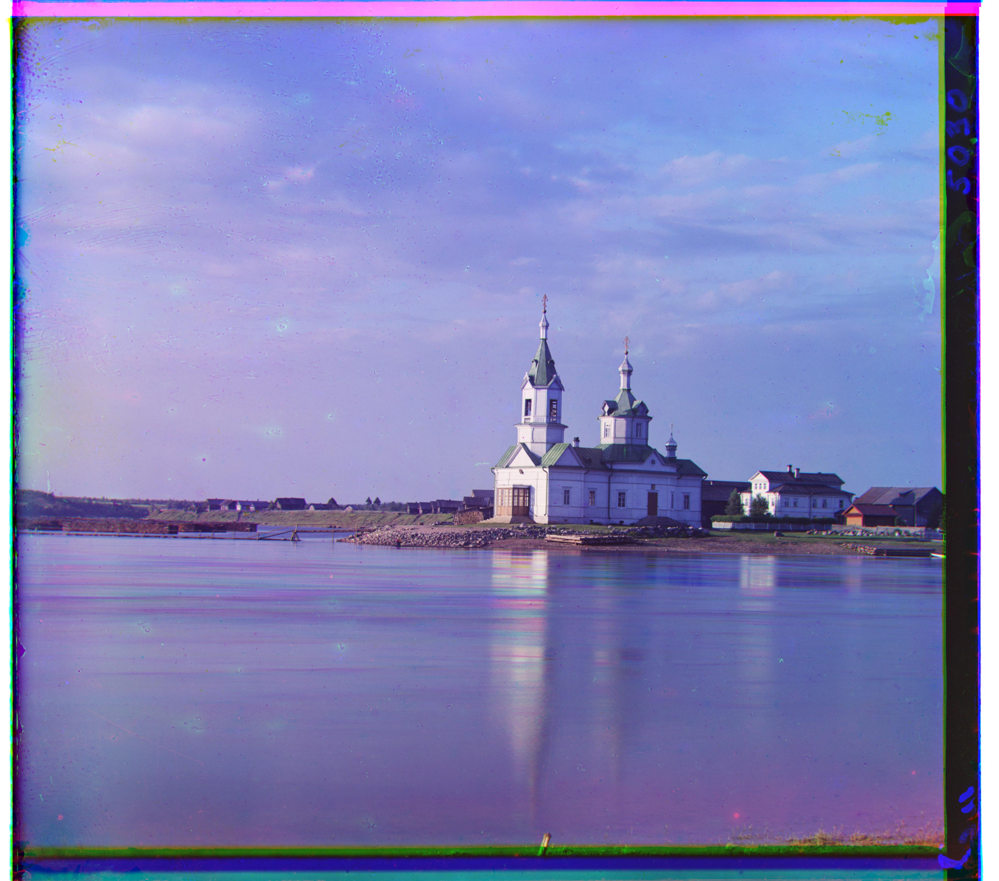

# Project 1: Images of the Russian Empire - Colorizing the Prokudin-Gorskii Photo Collection

## Overview
The goal of this assignment is to take the digitized Prokudin-Gorskii glass plate images and, using image processing techniques, automatically produce a color image with as few visual artifacts as possible. In order to do this, I extracted the three color channel images, place them on top of each other, and align them so that they form a single RGB color image.

## Approach
For the low resolution image, I initially computed the alignment with brute force, calculating the score between the base channel and Offset channel with normalized cross correlation, but the result isn't quite promising. The issue is resolved after I removed a percentage (default to 10%) of the border to prevent aligning the edges of the images.

  <figure>
    
    <figcaption>without border crop</figcaption>
  </figure>
  <figure>
    
    <figcaption>with border crop</figcaption>
  </figure>

For the high resolution image, I utilized image pyramid, where the image is downscaled to a certain level and applying the alignment process from the most-coarse level. By default, I set the scaling factor to 2 and levels to 5. This works reasonably well for most of the high resolution image, except for a few such as the image with label "emir". This in turn was resolved by utilizing sobel edge detection, which computes the gradient of the image intensity at each pixel, emphasizing regions where the intensity changes sharply.

  <figure>
    
    <figcaption>without sobel edge detection</figcaption>
  </figure>
  <figure>
    
    <figcaption>with sobel edge detection</figcaption>
  </figure>

## Image Gallery
<body>
<link rel="stylesheet" href="style.css">

    <button class="prev" onclick="moveSlides(-1)">&#10094;</button>
    

        

            

                
Cathedral

                
(Offset: G=[5, 2], R=[12, 3])

            

            

                
Church

                
(Offset: G=[25, 4], R=[58, -4])

            

            

                
Emir

                
(Offset: G=[49, 24], R=[107, 40])

            

            

                
Harvesters

                
(Offset: G=[60, 18], R=[124, 11])

            

            

                
Icon

                
(Offset: G=[40, 16], R=[89, 23])

            

            

                
Lady

                
(Offset: G=[57, 9], R=[120, 13])

            

            

                
Melons

                
(Offset: G=[80, 10], R=[124, 15])

            

            

                
Monastery

                
(Offset: G=[-3, 2], R=[3, 2])

            

            

                
Onion Church

                
(Offset: G=[52, 26], R=[108, 35])

            

            

                
Sculpture

                
(Offset: G=[33, -10], R=[124, -25])

            

            

                
Self Portrait

                
(Offset: G=[80, 30], R=[124, 39])

            

            

                
Three Generations

                
(Offset: G=[54, 12], R=[110, 8])

            

            

                
Tobolsk

                
(Offset: G=[3, 3], R=[6, 3])

            

            

                
Train

                
(Offset: G=[42, 9], R=[90, 33])

            

        

    

    <button class="next" onclick="moveSlides(1)">&#10095;</button>

</body>