# Project 2: Fun with Filters and Frequencies

## Overview
This project consist of two parts: The first part consist of experiments with two different filtering approach (Finite Difference Operator and Derivative of Gaussian Filter). The second part consist of a series of image transformation techniques through manipulating the frequencies of different images.

## Part 1: Fun with Filters

### Part 1.1: Finite Difference Operator
In this section, we compute the partial derivatives in the $x$ and $y$ directions of the cameraman image using finite difference operators $D_x$ and $D_y$ then apply convolution with these operators using scipy.signal.convolve2d. The gradient magnitude image is calculated by combining the partial derivatives. To obtain the result, we binarize the gradient magnitude image by selecting an appropriate threshold, which is chosen qualitatively to balance noise suppression while highlighting real edges.

  <figure>
    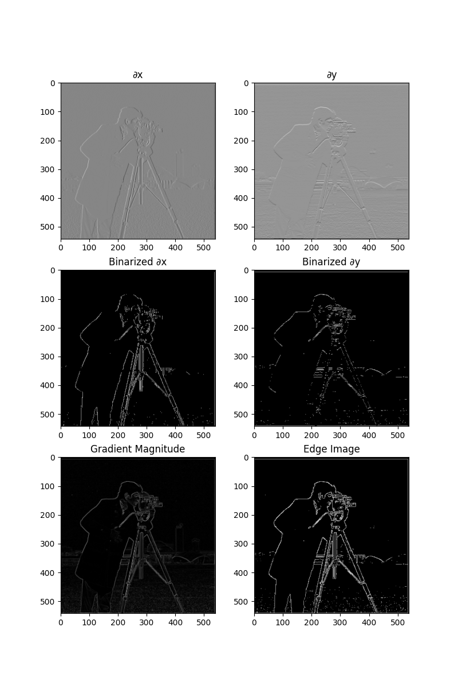
  </figure>

### Part 1.2: Derivative of Gaussian (DoG) Filter
The result from previous section wasn't ideal. One way to improve this is to apply a Gaussian blur filter $G$. The image is first blurred by convolving it with a 2D Gaussian kernel to create a 1D Gaussian, and then using an outer product to produce the 2D version. After smoothing, we repeat the procedure of computing partial derivatives and the gradient magnitude. Here, instead of performing two separate convolutions, we create derivative of Gaussian (DoG) filters by convolving the Gaussian filter with $D_x$ and $D_y$. The resulting DoG filters are then used to perform a single convolution for edge detection, producing results with smoother edges and less noise.

  <figure>
    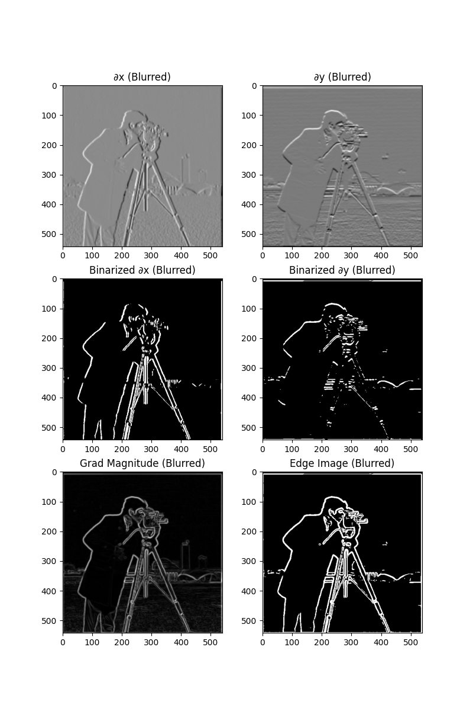
  </figure>

## Part 2: Fun with Frequencies!

### Part 2.1: Image "Sharpening"
In this section, we use the unsharp masking technique to sharpen a blurry image. First, a Gaussian filter is applied to the image to produce a blurred version, which captures the low-frequency components. The high-frequency details is then obtained from subtracting the blurred image from the original. To enhance the sharpness, we add a scaled version of these high frequencies back to the original image. Although the image's resolution has not been improved, the sharpening effect nevertheless made the imge looked more "clear".

  <figure>
    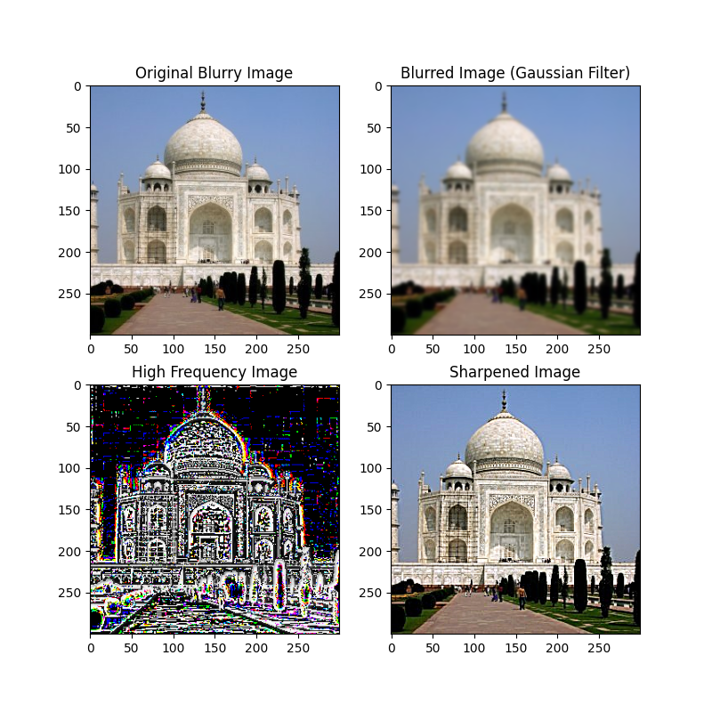
  </figure>

The fact that sharpening does not equate to increasing image resolution is evident in the second image - bars, which is blurry and only objects that were already clear to certain extent like the cans inside have displayed noticeable improvements.

  <figure>
    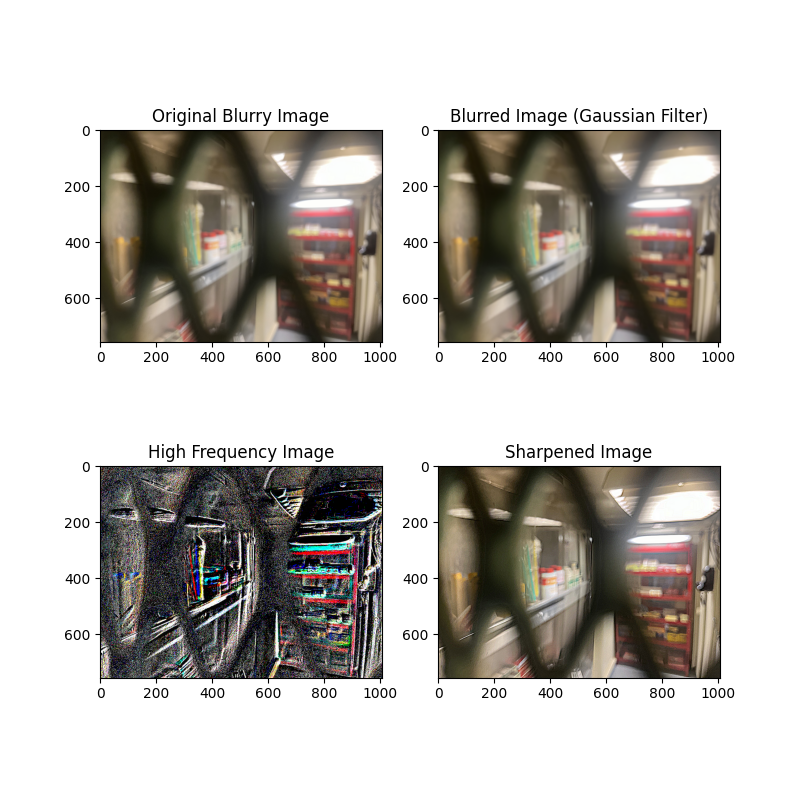
  </figure>

Furthermore, image resharpening can risk losing detail information. For the flower image below, which was already initially sharpened, appear to have bolder outlines. This effect gets increasingly apparent if we repeat the process a few more times as can be seen from the one below.

  <figure>
    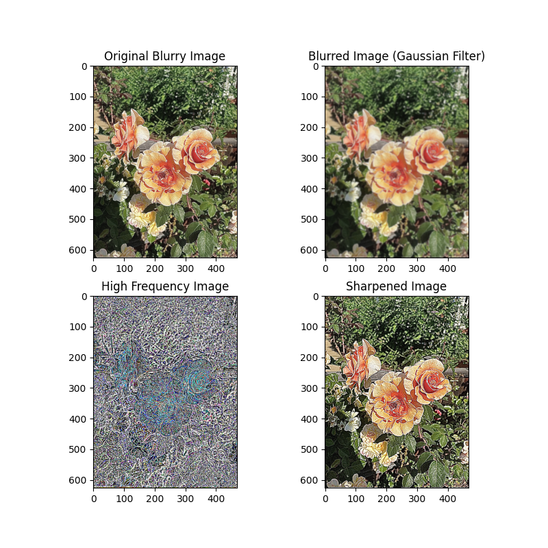
  </figure>

  <figure>
    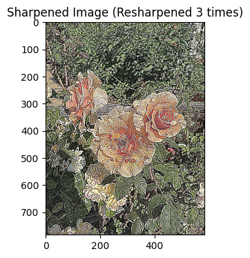
  </figure>

### Part 2.2: Hybrid Images
In this part, we create hybrid images that change their display based on the viewing distance (or how hard you squint), as described in the SIGGRAPH 2006 paper by Oliva, Torralba, and Schyns. Hybrid images are generated by blending the high-frequency content of one image with the low-frequency content of another. The high frequencies dominate when viewed up close, while only the low frequencies are perceived from a distance.

The process involves first aligning two input images, which is critical for proper perception. After alignment, we apply a low-pass filter (a 2D Gaussian filter) to one image to extract its smooth, low frequency components. For the second image, we apply a high-pass filter by subtracting its Gaussian-filtered version from the original to extract the high frequency details. The two filtered images are combined to produce the hybrid image.

  <figure style="display: flex; justify-content: space-around; align-items: center; width: 100%;">
    

      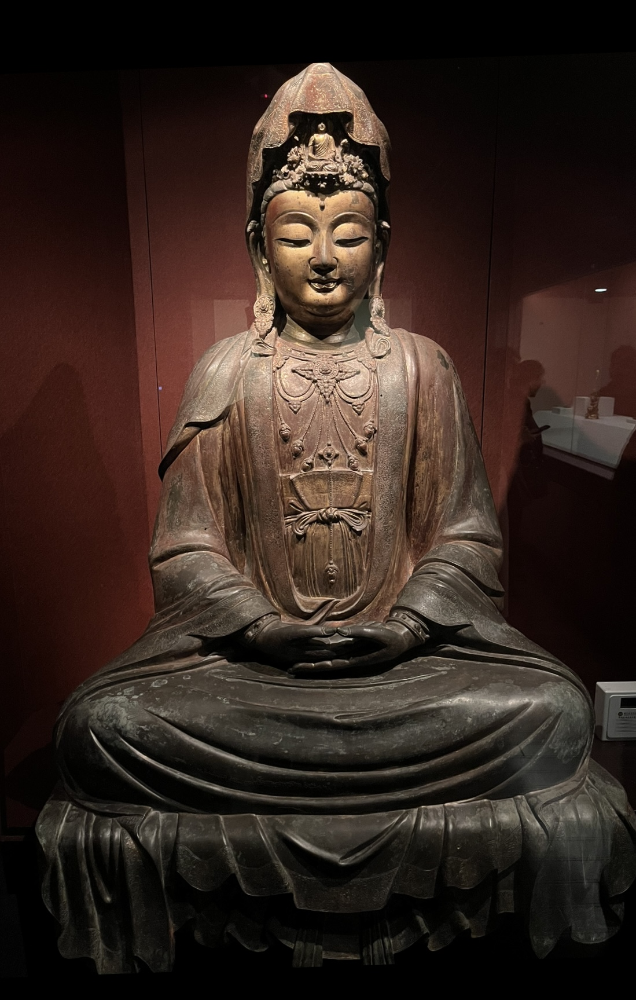
      <figcaption>Statue 1</figcaption>
    

    

      
      <figcaption>Statue 2</figcaption>
    

    

      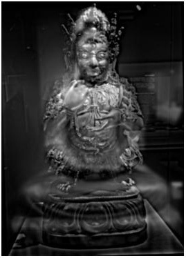
      <figcaption>Hybrid Statue</figcaption>
    

  </figure>

  <figure style="display: flex; justify-content: space-around; align-items: center; width: 100%;">
    

      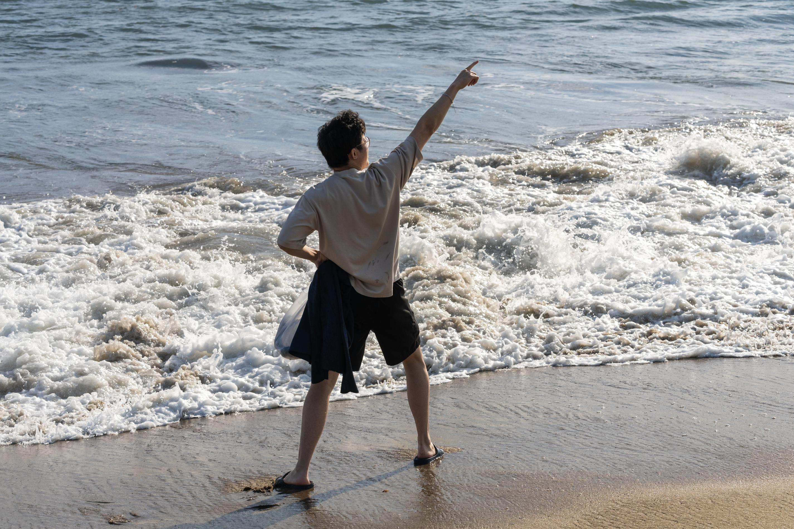
      <figcaption>Beach 1</figcaption>
    

    

      
      <figcaption>Beach 2</figcaption>
    

    

      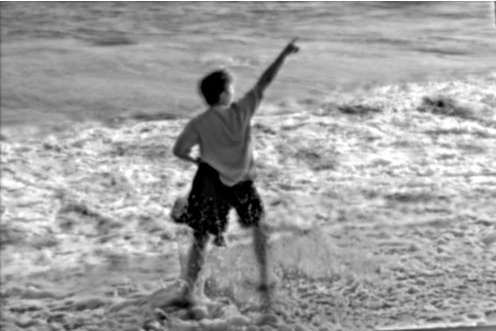
      <figcaption>Hybrid Beach</figcaption>
    

  </figure>

Below is the Fourier transform analysis condcuted on the beach images to visualize the hybrid process. As we can see, after extracting the image's respective frequency, the plot appears more distinct in spectrum. This demonstrates the frequency distribution of the images and how they contribute to the hybrid effect.

  <figure style="display: flex; justify-content: space-around; align-items: center; width: 100%;">
    

      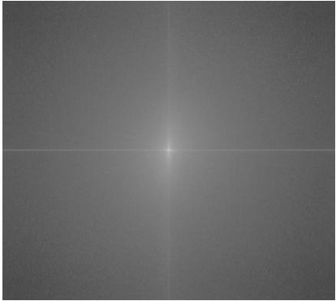
      <figcaption>Beach 1 (unfiltered)</figcaption>
    

    

      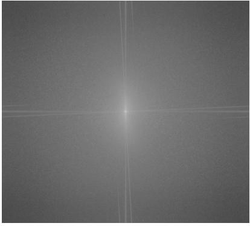
      <figcaption>Beach 2 (unfiltered)</figcaption>
    

  </figure>

  <figure style="display: flex; justify-content: space-around; align-items: center; width: 100%;">
    

      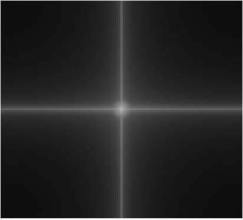
      <figcaption>Beach 1 (low frequency)</figcaption>
    

    

      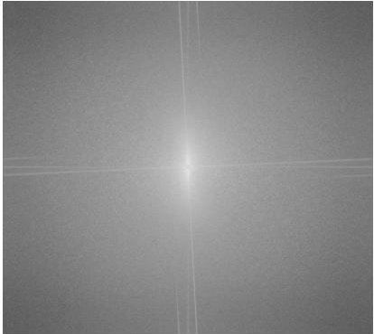
      <figcaption>Beach 2 (high frequency)</figcaption>
    

  </figure>

  <figure style="display: flex; justify-content: space-around; align-items: center; width: 100%;">
    

      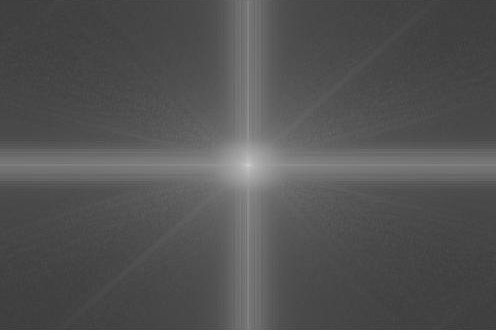
      <figcaption>Hybrid Beach</figcaption>
    

  </figure>

### Part 2.3: Gaussian and Laplacian Stacks
In this section, we implement Gaussian and Laplacian stacks to prepare for multi-resolution blending. Unlike pyramids that downsamples the image as we traverse, the stacks here maintain the same image dimension at each level. The Gaussian stack applies the Gaussian filter at each level. The Laplacian stack is constructed by computing the difference between successive levels of the Gaussian stack, capturing the high-frequency details at each level. Both stacks are stored in a 3D matrix (for grayscale images) where each level corresponds to a different degree of smoothing or high-frequency detail extraction. These stacks allow us to blend images in the next section of the project.

The first row displays the gaussian stacks, and the second row displays the laplacian stacks, both from level 0 to 4.

  <figure style="width: 100%;">
    

      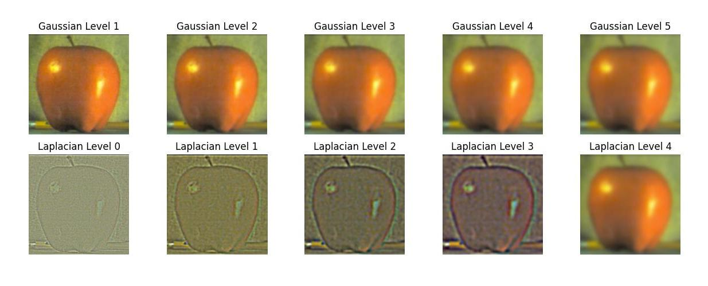
    

    

      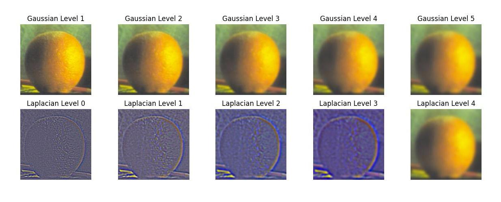
    

  </figure>

### Part 2.4: Multiresolution Blending
Here, we utilize result from previous section to implement multiresolution blending. This approach follows the ideas presented in Burt and Adelson’s 1983 paper. To blend two images, we first create Gaussian and Laplacian stacks for both input images (e.g., the apple and orange) and for the blending mask. Using the stacks, we blend the images by combining their Laplacian levels, guided by the Gaussian-blurred mask at each level. This results in a seamless blend where the transition between the two images is smooth and natural (though a part of the natural transition requires the two image being a plausible combination). After creating the blended Laplacian stack, we reconstruct the final blended image by adding the levels back together, starting from the highest to the lowest.

  <figure style="display: flex; justify-content: space-around; align-items: center; width: 100%;">
    

      
      <figcaption>Apple</figcaption>
    

    

      
      <figcaption>Orange</figcaption>
    

    

      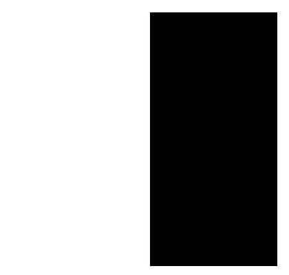
      <figcaption>Mask</figcaption>
    

  </figure>

  <figure style="display: flex; justify-content: space-around; align-items: center; width: 100%;">
    

      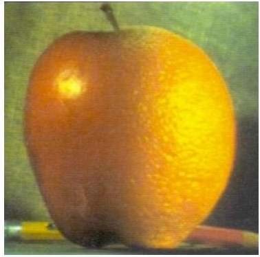
      <figcaption>Oraple</figcaption>
    

  </figure>

  <figure style="display: flex; justify-content: space-around; align-items: center; width: 100%;">
    

      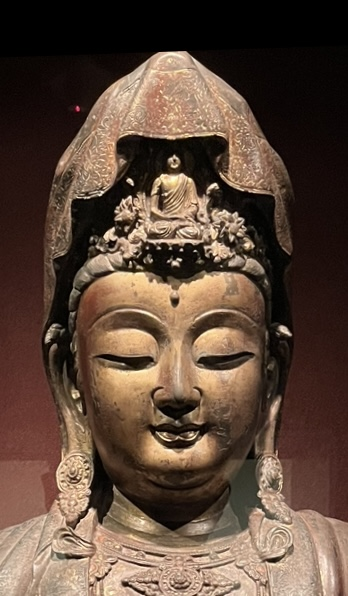
      <figcaption>Image 1</figcaption>
    

    

      
      <figcaption>Image 2</figcaption>
    

    

      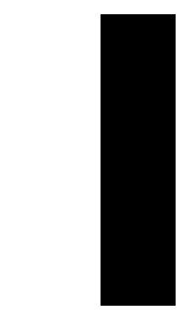
      <figcaption>Mask</figcaption>
    

  </figure>

  <figure style="display: flex; justify-content: space-around; align-items: center; width: 100%;">
    

      
    

  </figure>

Blending using irregular mask is more difficult but similar in essence. For the result below, I used an external tool to crop out the image I want to blend and convert it to pure binary (i.e. mask).

  <figure style="display: flex; justify-content: space-around; align-items: center; width: 100%;">
    

      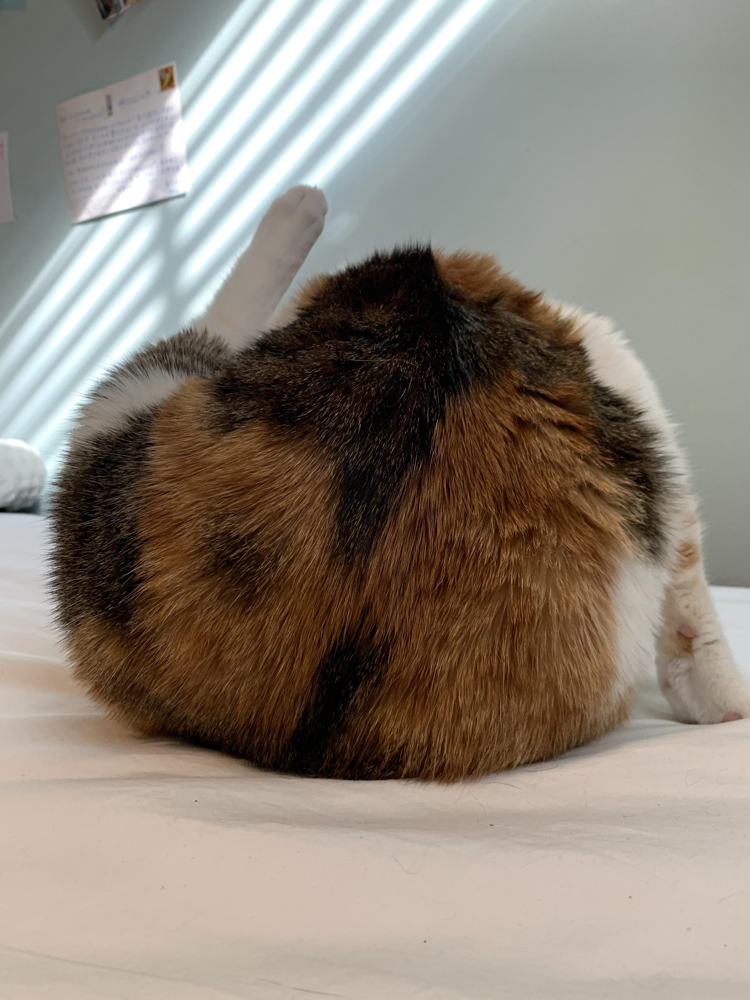
      <figcaption>Cat</figcaption>
    

    

      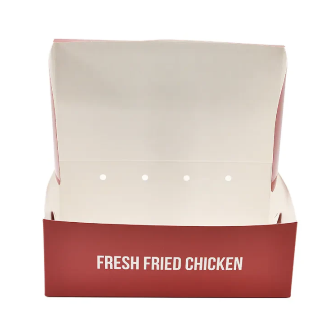
      <figcaption>Box</figcaption>
    

    

      
      <figcaption>Mask</figcaption>
    

  </figure>

  <figure style="display: flex; justify-content: space-around; align-items: center; width: 100%;">
    

      
      <figcaption>Cat drumstick</figcaption>
    

  </figure>

Overall, a key takeaway is the role of Gaussian blur and frequency in image processing (especially blending). By applying Gaussian filters, we can effectively highlight the key components of an image, which can then help us extract the information for edge detection. Furthermore, we can effectively smooth images, extract high-frequency edges, and create seamless transitions between images in tasks like hybrid image creation and multiresolution blending. It is through this project had I better understand the essence of image in digital representation - that they are just numbers - Prof. Efros in the introductory lecture. During the process of work, a significant amount of time was allocated to adjusting the parameters (e.g. channels, resolution, dimension, frequency, kernel, standard deviation (of Gaussian), etc), as a change to any of them may cause the whole pipeline produce a completely different result.

<link rel="stylesheet" href="style.css">
