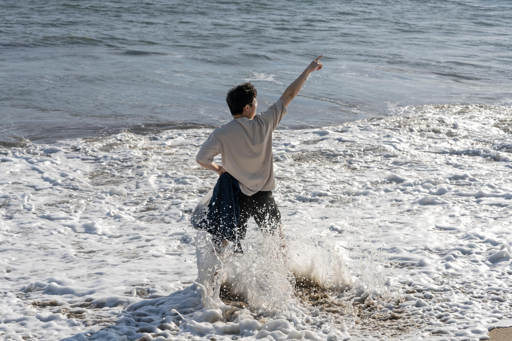

# Project 2: Fun with Filters and Frequencies

## Overview
This project consist of two parts: The first part consist of experiments with two different filtering approach (Finite Difference Operator and Derivative of Gaussian Filter). The second part consist of a series of image transformation techniques through manipulating the frequencies of different images.

## Part 1: Fun with Filters

### Part 1.1: Finite Difference Operator

  <figure>
    
  </figure>

### Part 1.2: Derivative of Gaussian (DoG) Filter

  <figure>
    
  </figure>

## Part 2: Fun with Frequencies!

### Part 2.1: Image "Sharpening"

  <figure>
    
  <figcaption>taj</figcaption>
  </figure>

  <figure>
    
  <figcaption>bars (blurry image)</figcaption>
  </figure>

  <figure>
    
  <figcaption>flower (sharp image)</figcaption>
  </figure>

  <figure>
    
  </figure>

### Part 2.2: Hybrid Images

  <figure style="display: flex; justify-content: space-around; align-items: center; width: 100%;">
    

      
      <figcaption>Statue 1</figcaption>
    

    

      
      <figcaption>Statue 2</figcaption>
    

    

      
      <figcaption>Hybrid Statue</figcaption>
    

  </figure>

  <figure style="display: flex; justify-content: space-around; align-items: center; width: 100%;">
    

      
      <figcaption>Beach 1</figcaption>
    

    

      
      <figcaption>Beach 2</figcaption>
    

    

      
      <figcaption>Hybrid Beach</figcaption>
    

  </figure>

Fourier Transform Analysis

  <figure style="display: flex; justify-content: space-around; align-items: center; width: 100%;">
    

      
      <figcaption>Beach 1 (unfiltered)</figcaption>
    

    

      
      <figcaption>Beach 2 (unfiltered)</figcaption>
    

  </figure>

  <figure style="display: flex; justify-content: space-around; align-items: center; width: 100%;">
    

      
      <figcaption>Beach 1 (low frequency)</figcaption>
    

    

      
      <figcaption>Beach 2 (high frequency)</figcaption>
    

  </figure>

  <figure style="display: flex; justify-content: space-around; align-items: center; width: 100%;">
    

      
      <figcaption>Hybrid Beach</figcaption>
    

  </figure>

### Part 2.3: Gaussian and Laplacian Stacks
The first row displays the gaussian stacks, and the second row displays the laplacian stacks, both from level 0 to 4.

  <figure style="width: 100%;">
    

      
    

    

      
    

  </figure>

### Part 2.4: Multiresolution Blending

  <figure style="display: flex; justify-content: space-around; align-items: center; width: 100%;">
    

      
      <figcaption>Apple</figcaption>
    

    

      
      <figcaption>Orange</figcaption>
    

    

      
      <figcaption>Mask</figcaption>
    

  </figure>

  <figure style="display: flex; justify-content: space-around; align-items: center; width: 100%;">
    

      
      <figcaption>Oraple</figcaption>
    

  </figure>

  <figure style="display: flex; justify-content: space-around; align-items: center; width: 100%;">
    

      
      <figcaption>Image 1</figcaption>
    

    

      
      <figcaption>Image 2</figcaption>
    

    

      
      <figcaption>Mask</figcaption>
    

  </figure>

  <figure style="display: flex; justify-content: space-around; align-items: center; width: 100%;">
    

      
    

  </figure>

  <figure style="display: flex; justify-content: space-around; align-items: center; width: 100%;">
    

      
      <figcaption>Cat</figcaption>
    

    

      
      <figcaption>Box</figcaption>
    

    

      
      <figcaption>Mask</figcaption>
    

  </figure>

  <figure style="display: flex; justify-content: space-around; align-items: center; width: 100%;">
    

      
      <figcaption>Cat drumstick</figcaption>
    

  </figure>

<link rel="stylesheet" href="style.css">
