# Project 3: Face Morphing and Modelling a Photo Collection

## Overview
The goal of this project is to produce a "morph" animation of my face into someone else's face. A morph is a simultaneous warp of the image shape and a cross-dissolve of the image colors. The cross-dissolve is the easy part; controlling and doing the warp is the hard part. The warp is controlled by defining a correspondence between the two pictures. The correspondence should map eyes to eyes, mouth to mouth, chin to chin, ears to ears, etc., to get the smoothest transformations possible.

## Part 1. Defining Correspondences
For this part, I used the correspondence tool to generate the (62) points of correspondence for me and my friend King. Using the correspondence, I then plot the triangulation (using delaunay) on the original image:

    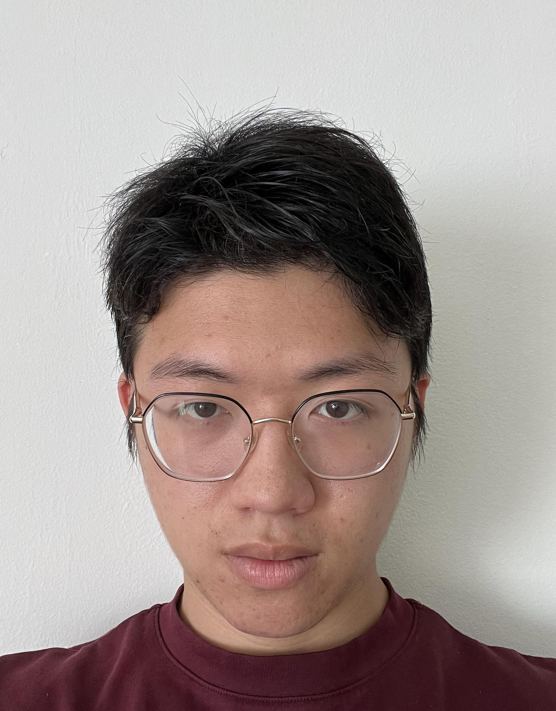
    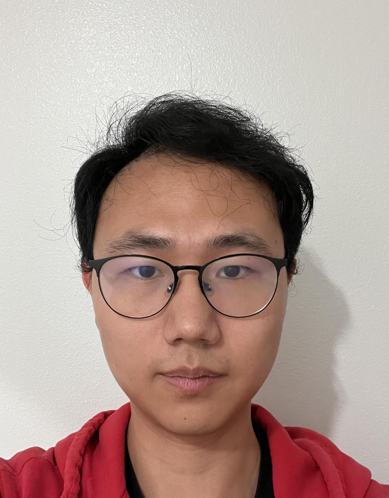

to create:

    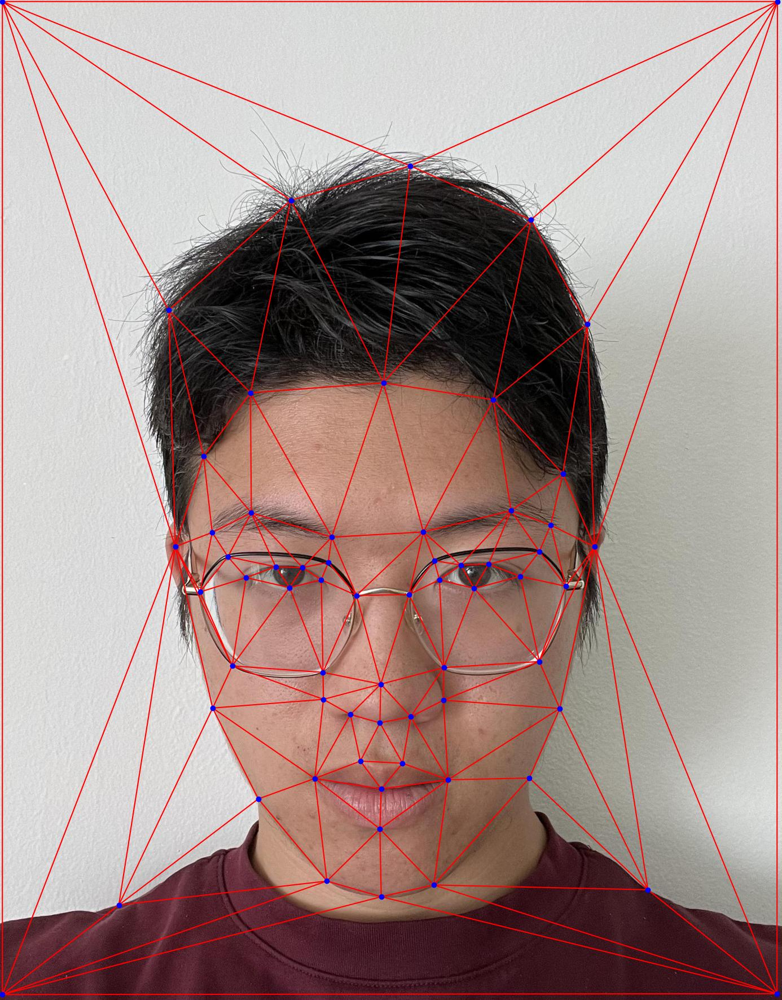
    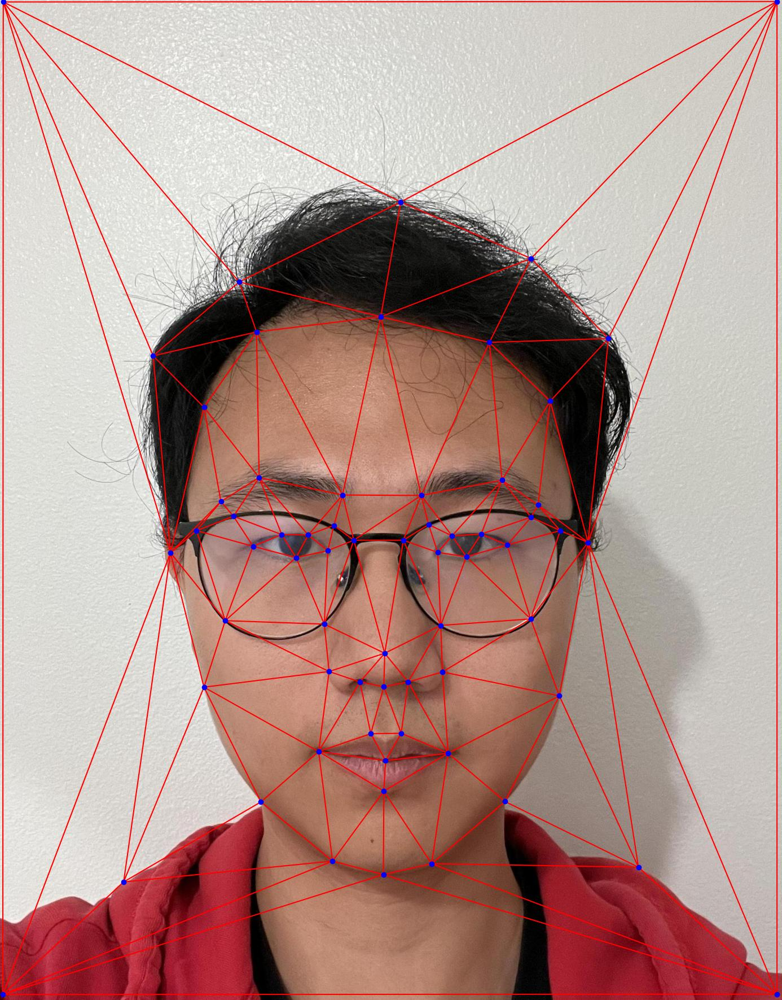

## Part 2. Computing the "Mid-way Face"
This part involves multiple steps. To create the mid-way face image, I first
1) computed the average shape (i.e. average of each corresponding keypoints pair from images A and B).
2) Then, each triangle from image A and image B should be warped into the corresponding triangle in the average shape. This is done by computing an affine transformation matrix and use the inverse affine warp to bring the pixels from both images into the average shape.
3) Finally, the color also has to be averaged to create the mid-way face.

    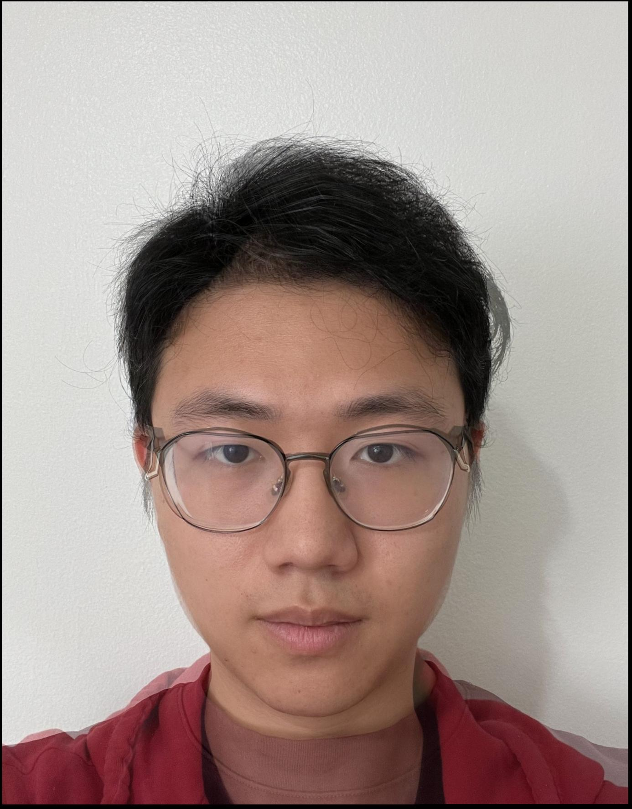

## Part 3. The Morph Sequence
With the original images and the mid-way face image at hand, we can conduct the morphing process by:
1) first warp im1 and im2 into an intermediate shape configuration controlled by warp_frac as per the suggestion, and then cross-dissolved according to dissolve_frac.
2) For interpolation, both parameters lie in the range [0,1]. They are the only parameters that will vary from frame to frame in the animation. For the starting frame, they will both equal 0, and for the ending frame, they will both equal 1.

For the output, I created a 60 frames gif as follow:

    

## Part 4. The "Mean face" of a population
For this part, I used the FEI neutral expression dataset, which consists of 200 images (100 male and 100 female). The process involves:
1) Compute the average face shape, which is done by averaging all keypoints across the dataset.
2) Morph each face in the dataset into the average shape and display some examples.

1a:

    
    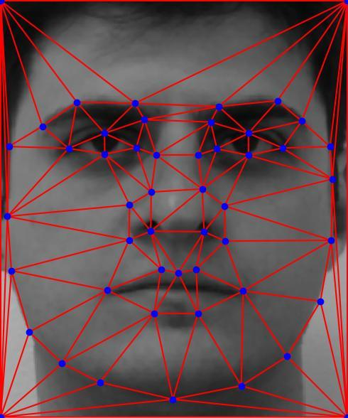
    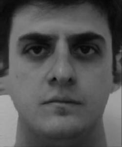

2a:

    
    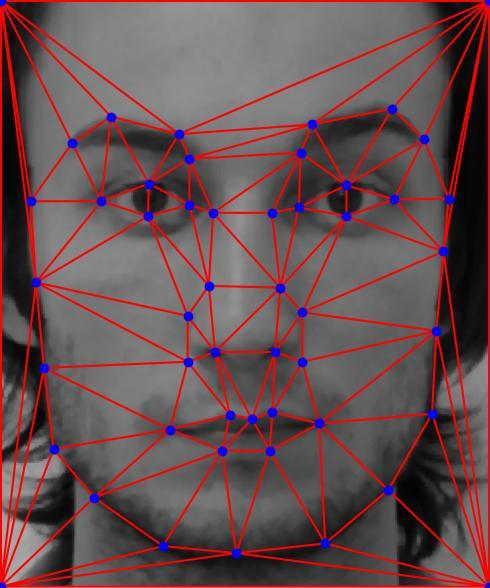
    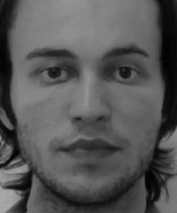

3a:

    
    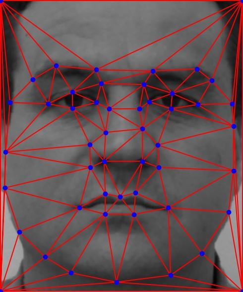
    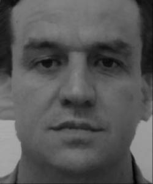

3) Compute the average face of the dataset by warping all faces to the average shape and averaging the pixel values.

    <figure style="width: 40%; text-align: center; margin: 0 auto;">
        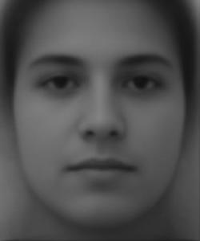
        <figcaption>Average Face of 200 neutral expressions</figcaption>
    </figure>

4) Warp my face into the average geometry and the average face into your face's geometry.

    <figure style="width: 33%; margin: 10px; text-align: center;">
        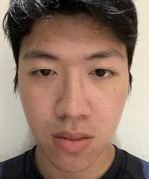
        <figcaption>Jason (original)</figcaption>
    </figure>
    <figure style="width: 33%; margin: 10px; text-align: center;">
        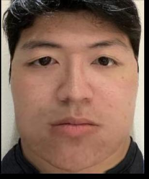
        <figcaption>Jason to average</figcaption>
    </figure>
    <figure style="width: 33%; margin: 10px; text-align: center;">
        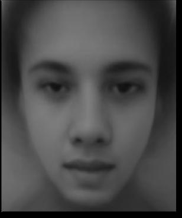
        <figcaption>Average to Jason</figcaption>
    </figure>

The Jason-to-average image looks a bit odd, mainly due to the number of points available for warping (the dataset has 46 points by default, 50 including the corners I added manually for alignment).

## Part 5. Caricatures: Extrapolating from the mean
Finally, I computed the caricature for my face by adding the difference of my face and the average face onto my face, resulting in an image that emphasises my features.

    <figure style="width: 40%; text-align: center; margin: 0;">
        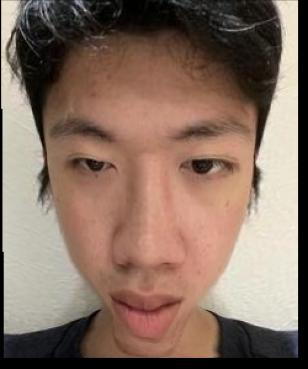
        <figcaption>alpha = 0.75</figcaption>
    </figure>

## Bells and Whistles
For the extra credit, I changed the gender of my face by morphing with the average Chinese female face (thanks to Chloe Zhong for providing the source).

Here are the original images:

    <figure style="width: 50%; margin: 10px;">
        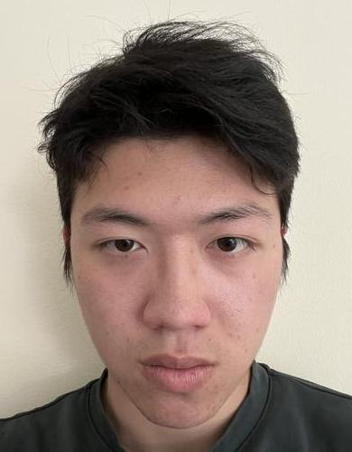
        <figcaption>Jason (no glasses)</figcaption>
    </figure>
    <figure style="width: 50%; margin: 10px;">
        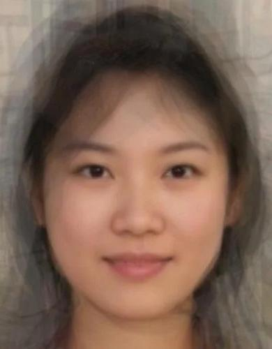
        <figcaption>Chinese average woman</figcaption>
    </figure>

Here are the results:

    <figure style="width: 33%; margin: 10px;">
        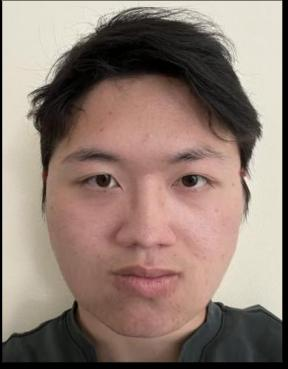
        <figcaption>only shape</figcaption>
    </figure>
    <figure style="width: 33%; margin: 10px;">
        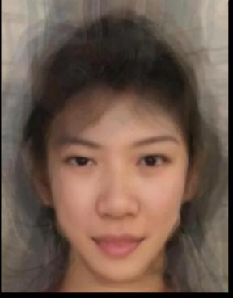
        <figcaption>only appearance</figcaption>
    </figure>
    <figure style="width: 33%; margin: 10px;">
        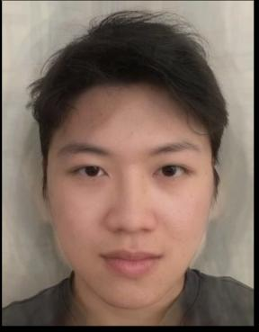
        <figcaption>both</figcaption>
    </figure>

